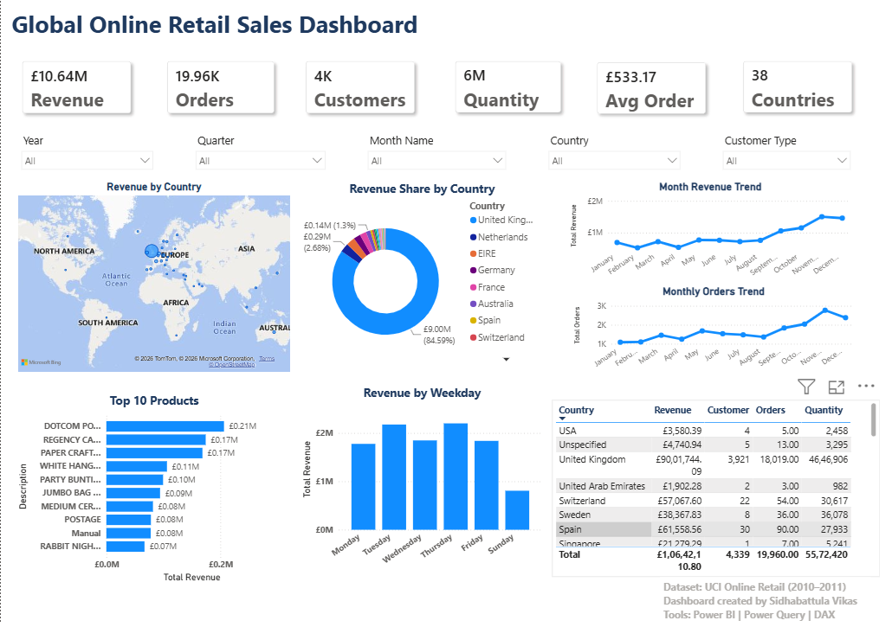

# 📊 Global Online Retail Sales Dashboard

An interactive **Power BI dashboard** built using the **UCI Online Retail Dataset (2010–2011)** to analyze sales performance, customer behavior, product performance, and country-wise revenue through interactive visualizations and business KPIs.

---

## 📸 Dashboard Preview

<p align="center">
  
</p>

---

## 📌 Project Overview

This dashboard transforms raw retail transaction data into meaningful business insights using **Power BI**, **Power Query**, and **DAX**.

It enables users to:

- Analyze revenue performance
- Track monthly sales trends
- Identify top-performing products
- Compare country-wise sales
- Understand customer purchasing behavior
- Filter insights dynamically using interactive slicers

---

## 🎯 Business Objectives

- Monitor overall business performance
- Identify top revenue-generating countries
- Analyze monthly sales growth
- Discover best-selling products
- Evaluate customer distribution
- Support data-driven business decisions

---

## 📈 Dashboard KPIs

| KPI | Value |
|------|------:|
| 💰 Total Revenue | £10.64M |
| 🛒 Total Orders | 19.96K |
| 👥 Total Customers | 4K |
| 📦 Total Quantity Sold | 6M |
| 💳 Average Order Value | £533.17 |
| 🌍 Countries Served | 38 |

---

## 📊 Dashboard Features

### Interactive Filters

- Year
- Quarter
- Month
- Country
- Customer Type

### Visualizations

- 🌍 Revenue by Country (Map)
- 🍩 Revenue Share by Country (Donut Chart)
- 📈 Monthly Revenue Trend
- 📈 Monthly Orders Trend
- 📦 Top 10 Products by Revenue
- 📅 Revenue by Weekday
- 📋 Country-wise Performance Table

---

## 🛠 Tools & Technologies

- Power BI Desktop
- Power Query
- DAX (Data Analysis Expressions)
- Microsoft Excel

---

## 📂 Dataset

**Source:** UCI Machine Learning Repository

**Dataset:** Online Retail Dataset (2010–2011)

🔗 Dataset Link:
**[https://archive.ics.uci.edu/dataset/352/online-retail]**

---

## 💡 Key Business Insights

- United Kingdom contributes the highest share of total revenue.
- Revenue increases significantly during October–December.
- A small number of products generate the majority of revenue.
- Weekday sales outperform weekend sales.
- Customers from 38 countries contribute to overall business revenue.

---

## 🧠 Skills Demonstrated

- Data Cleaning
- Data Transformation
- Data Modeling
- DAX Calculations
- Dashboard Design
- Data Visualization
- Business Intelligence
- Analytical Thinking

---

## 📁 Project Files

```
📂 Global-Online-Retail-Sales-Dashboard
│
├── Global-Online-Retail-Sales-Dashboard.pbix
├── Dashboard.pdf
├── Dashboard.png
└── README.md
```

---

## 🚀 Live Demo

### 📊 Power BI Dashboard

🔗 **[Global-Online-Retail-Sales-Dashboard.pbix]**

---

### 💻 GitHub Repository

🔗 **https://github.com/vikas03-67c1/Global-Online-Retail-Sales-Dashboard**

---

## 👨‍💻 Author

**Sidhabattula Vikas**

🎓 B.Tech – Computer Science (Data Science)

📍 Hyderabad, India

---

## 🌐 Connect With Me

💼 LinkedIn

**https://www.linkedin.com/in/sidhabattulavikas200403/**

📧 Email

**sidhabattulavikas200403@gmail.com**

💻 GitHub

**https://github.com/vikas03-67c1/**

---

## ⭐ If you found this project helpful, consider giving it a Star!
